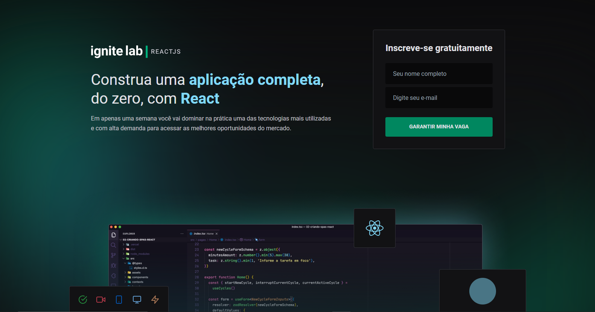
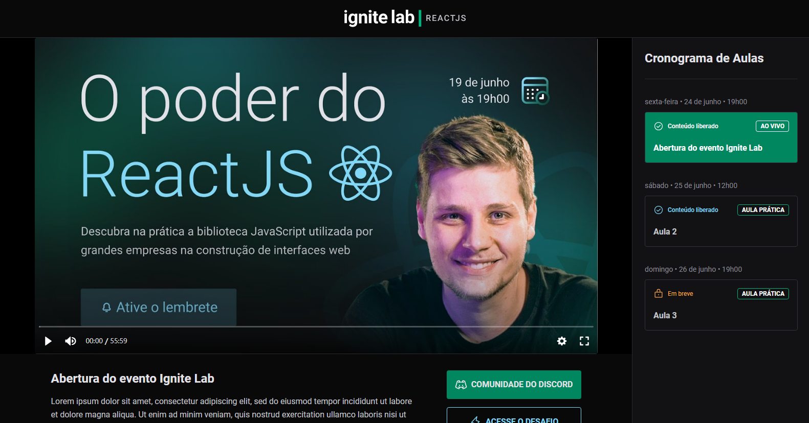
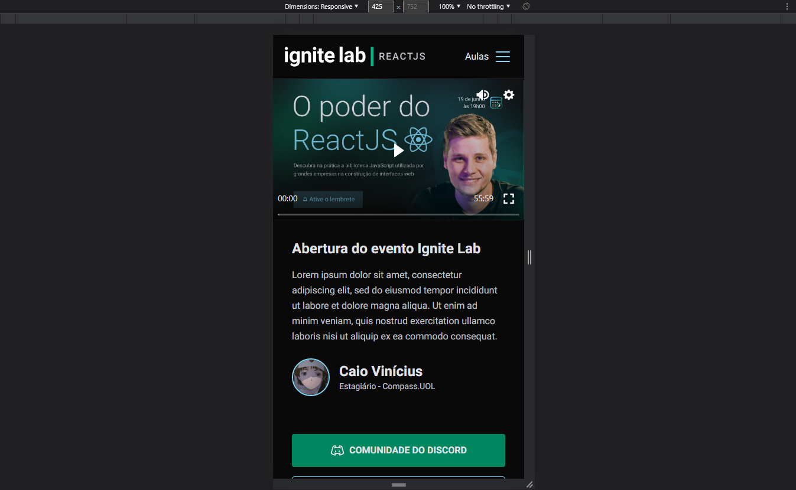
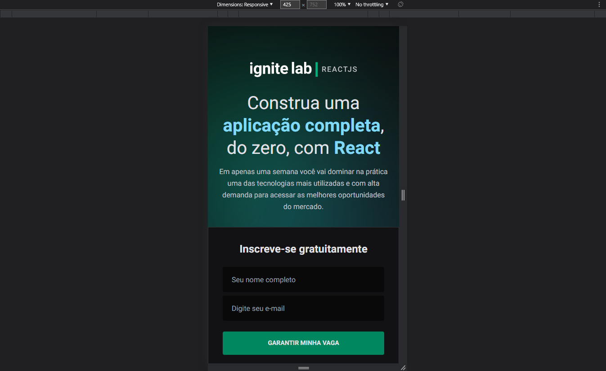

# Event Platform
Uma aplicação de uma plataforma de evento no estilo de vídeo aulas, contendo uma página de inscrição e outra onde contém as aulas em si. Feito a partir do evento Ignite Lab da rocketseat.

# 🖼 Screenshots
### Página de inscrição

### Página de aula

### Página de aula responsiva

### Página de inscrição responsiva

# 🚀 Tecnologias
 - Vite
 - ReactJS
 - TailwindCSS
 - GraphQL
 - Apollo
 - GraphQL Code Generator
 - Date fns
 - Classnames